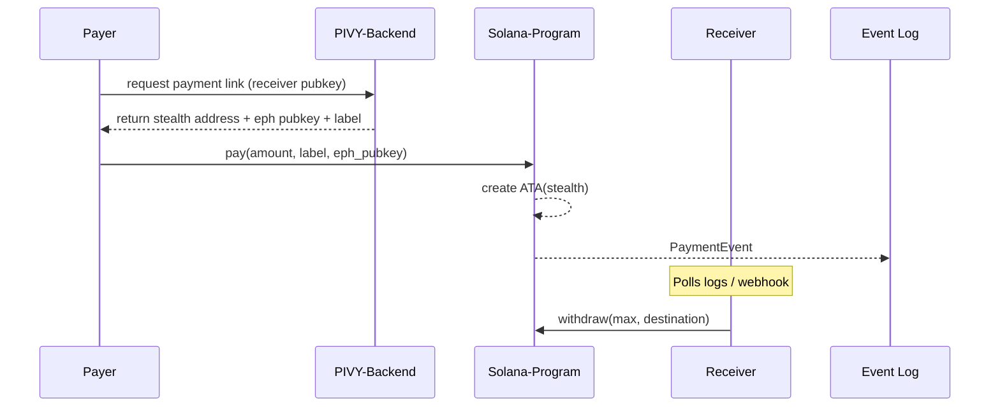

# PIVY ‑ Stealth Addresses on Solana

> **The first ERC-5564-inspired stealth-payment protocol live on Solana DEVNET.**  
> Try it now at **https://pivy.me**

---

## ✨ TL;DR

* **PIVY** turns any Solana wallet into a *private, unlinkable* escrow address – no additional keys required.
* Built on the **ERC-5564 "Stealth Addresses"** standard, adapted to Solana's account-model & CPI rules.
* Payments land in a one-time **Associated Token Account (ATA)** controlled solely by the receiver – *no custodian, no relayer*.
* Funds can be swept out at any time with a single **withdraw** instruction, leaving zero on-chain footprint.
* Supports **USDC CCTP**: pay from *any* major EVM chain, settle privately on Solana.

---

## 1. Why Stealth Addresses?
Traditional public-key payments leak the receiver's full balance history.  
ERC-5564 proposes an elegant fix: pay to a *fresh* address derived from a shared secret between payer & receiver. Only the receiver can recognize & spend the funds.

PIVY brings this paradigm to Solana, preserving:

1. **Self-custody** – the stealth ATA is owned by the receiver's keypair.
2. **Auditable privacy** – transfers are still on-chain, but unlinkable to the public wallet.
3. **UX simplicity** – payers just click a `pivy link`, no SDK required.

---

## 2. High-level Architecture



### Key On-chain Objects

| Account | Purpose |
|---------|---------|
| `stealth_owner` (unchecked PDA) | *Ephemeral* public key derived from ECDH(secret, receiver)|
| `stealth_ata` | ATA owned by `stealth_owner`, lazily created on first payment |
| `PaymentEvent` | Emitted for **pay** *and* **announce**; off-chain indexer keeps UX snappy |
| `WithdrawEvent` | Emitted after a successful sweep |

---

## 3. Program Anatomy (src/lib.rs)

The Anchor program exposes three instructions:

1. **pay** – move SPL tokens from payer's ATA → stealth ATA and emit `PaymentEvent`.
2. **withdraw** – receiver signs with *stealth_owner* seed to sweep funds and auto-close empty ATA.
3. **announce** – emit *only* the `PaymentEvent`; useful for prepaid on-ramp flows.

Error handling is lean (`InvalidAmount`, `DestinationOwnerMismatch`, `SameAccount`) to keep TX size minimal.

### Gas-savvy Features
* **Lazily-created ATAs** – the first payment handles creation so the receiver never pays rent.
* **Auto-close** – if balance hits zero the ATA is closed and rent is refunded to the receiver.
* **Log-only announce** – zero-lamport alternative when funds arrive via an external bridge (see CCTP).

---

## 4. Cross-Chain USDC via CCTP 🪄
PIVY natively supports the **Circle Cross-Chain Transfer Protocol**:

1. User initiates USDC transfer on *Ethereum / Arbitrum / OP / Base / Polygon zkEVM…*.
2. CCTP mints canonical USDC on Solana and delivers to a `temp` ATA.
3. Backend triggers **announce** so the receiver is notified instantly.
4. Once the receiver deems it safe, they call **withdraw** – *everything happens in their wallet*.

👉 This makes PIVY links universal: *send from MetaMask, receive privately on Solana*.

---

## 5. End-to-End Flow

1. **Generate Link**  
   `https://pivy.me/<alias>` – e.g. `https://pivy.me/john`.  The alias resolves to an encoded payload containing the `eph_pubkey`, human-readable `label`, and optional amount preset.
2. **Share & Pay**  
   Payer clicks → Phantom devnet pops up → Sends SPL/USDC.
3. **Notification**  
   Receiver's app/backend listens for `PaymentEvent` filtered by their viewing-key.
4. **Withdraw**  
   Receiver signs a regular transaction to move funds to their *public* wallet or any ATA they choose.

No central service ever touches user keys or funds.

---

## 6. Why PIVY Rocks 🤘

* **First-mover on Solana** – brings the privacy enhancements of ERC-5564 to the fastest L1.
* **Pure-Rust, 100 LoC core** – minimal, auditable, battle-tested primitives (Anchor 0.29).
* **Composable** – other programs can CPI into `pay` / `announce` for on-chain invoicing.
* **Open Source** – MIT licensed, split into:
  * `pivy-stealth` (this repo) – on-chain program
  * [`pivy-backend`](https://github.com/pivyme/pivy-backend) – **the system that powers the whole platform** (indexer + REST)
  * [`pivy-app`](https://github.com/pivyme/pivy-app) – **the frontend** web wallet & link generator

---

## 7. Stealth Address Implementation 🔍

Below is a simplified—but accurate—view of how PIVY adapts **ERC-5564** to Solana's account model.

### 1. Ephemeral Key Exchange

1. **Backend** generates an _ephemeral_ keypair `(d, D)` every time a link is minted.
2. Using the receiver's public key `R`, it computes a shared secret `S = d · R` (Elliptic-Curve Diffie-Hellman on ed25519).
3. The public half `D` is embedded in the link so the receiver can perform `S' = r · D` with their secret key `r`. Because ECDH is symmetric, `S = S'`.

### 2. Deriving the Stealth Owner

The shared secret is hashed to a 32-byte seed and used to deterministically generate a *new* keypair `(s, S_pub)`:

```text
seed   = SHA256(b"pivy-stealth" || S)
s, Sₚₑᵤ = Ed25519KeypairFromSeed(seed)
```

`S_pub` becomes the **stealth_owner** account passed to the on-chain program:

```rust
#[account(mut)]
pub stealth_owner: UncheckedAccount<'info>,
```

Because only the receiver can re-derive `s`, they—and _only_ they—can later sign the **withdraw** instruction.

### 3. Payment Flow On-Chain

1. Payer invokes `pay` with `(amount, label, eph_pubkey = D)`.
2. The program lazily creates **stealth_ata = ATA(S_pub, mint)`**.
3. Tokens move from `payer_ata → stealth_ata` under the payer's signature.
4. A `PaymentEvent` is emitted containing the opaque `label` and `D` so off-chain indexers can match it.

### 4. Withdrawal Flow

When the receiver wishes to reveal/spend the funds, they:

1. Recompute `(s, S_pub)` locally.
2. Sign a `withdraw` instruction as **stealth_owner = S_pub**.
3. The program moves funds `stealth_ata → destination_ata` and auto-closes `stealth_ata` if empty, refunding rent.

No additional trust assumptions are introduced—**PIVY never holds private keys or escrow authority**.

And that's the magic: a <1 KB on-chain program, a pinch of ECDH, and your Solana address becomes *invisible* until you decide otherwise.
